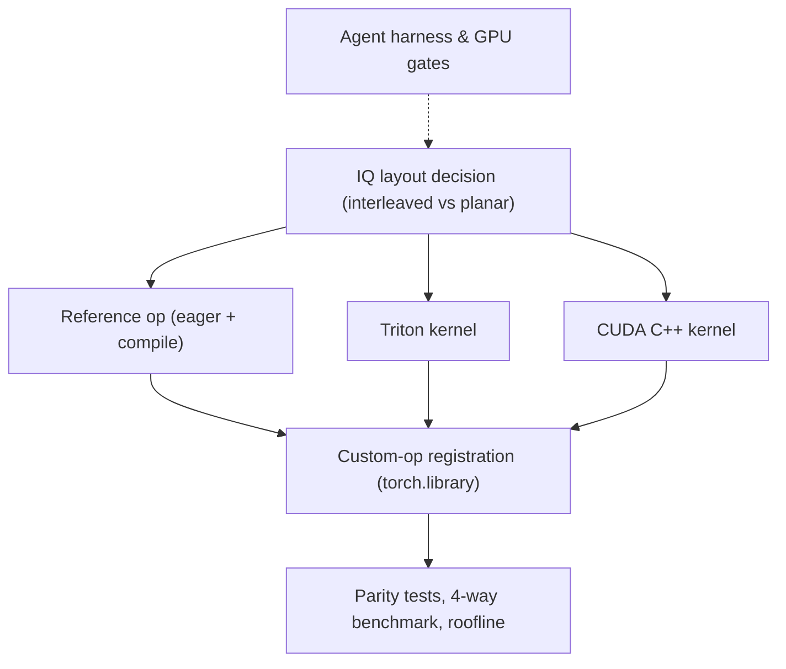

# Tutorial: fused-iq-kernel

A **fused complex-IQ classification layer** written four ways — PyTorch eager,
`torch.compile`, hand-written Triton, and hand-written CUDA C++ — registered as
proper PyTorch custom ops and benchmarked head-to-head with an honest report
card (including a roofline analysis on the actual profiled GPU).

**Source spec:** `../portfolio-projects.md` (Project 3) · **State:** see `Active:` line in `CLAUDE.md`

## Core abstractions (planned — chapters land as prompts PASS)

## Chapters

**Prompt 1 — PASSED** (macOS arm64 CPU baselines; timings PROVISIONAL).

| # | Chapter | Covers |
|---|---|---|
| 1 | [IQ Layout Decision](01_iq_layout_decision.md) | Interleaved `complex64`, `float2` coalescing rationale, constraint on Prompts 2/3 |
| 2 | [Reference Op and Baselines](02_reference_op_and_baselines.md) | Complex conv decomposition, `fused_stage()` parity boundary, `torch.compile` baseline, PROVISIONAL CPU benchmark table |

Chapters 3–6 land at each subsequent prompt EXIT.

**Extension — W4A16 fused dequant+GEMM** (scaffold committed `10b8deb`, GPU run PARKED).
A second kernel family targeting the inference hiring-signal (guide P3) and open kernel-gap
issues at NVIDIA kernel-libs / RadixArk / SGLang.

| # | Doc | Covers |
|---|---|---|
| W | [W4A16 design](design_w4a16.md) | int4→fp16 group-dequant fused into the matmul, packing/layout, parity contract, baselines to beat (bitsandbytes/GPTQ). 21 parity tests collect on CPU, skip on no-CUDA. |

Spec-locked decisions worth knowing up front:

1. **IQ memory layout** is decided once in Prompt 1 (`docs/design.md`) — every
   later kernel must match it.
2. Registration uses the **direct `torch.library.Library` API** with a
   `register_fake` meta-kernel (not the decorator API).
3. Prompts 2/3/5 are **GPU_STEP** on this macOS machine: kernels get written
   locally, compiled/profiled only on a remote CUDA host. No fabricated timings.

---
*Maintained in the style of [PocketFlow-Tutorial-Codebase-Knowledge](https://github.com/The-Pocket/PocketFlow-Tutorial-Codebase-Knowledge); updated at each prompt EXIT.*
